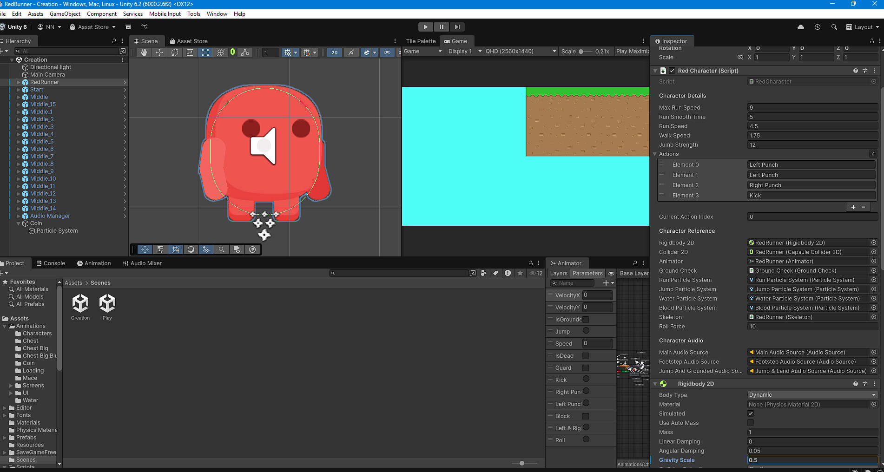
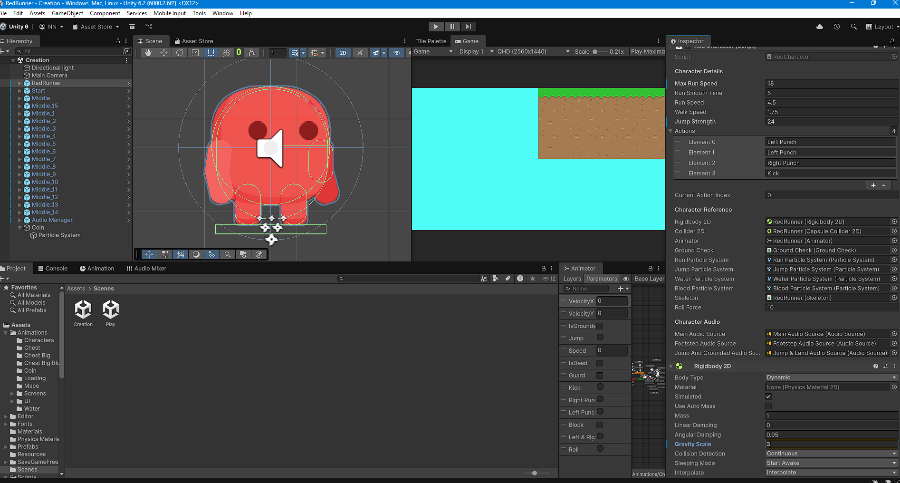
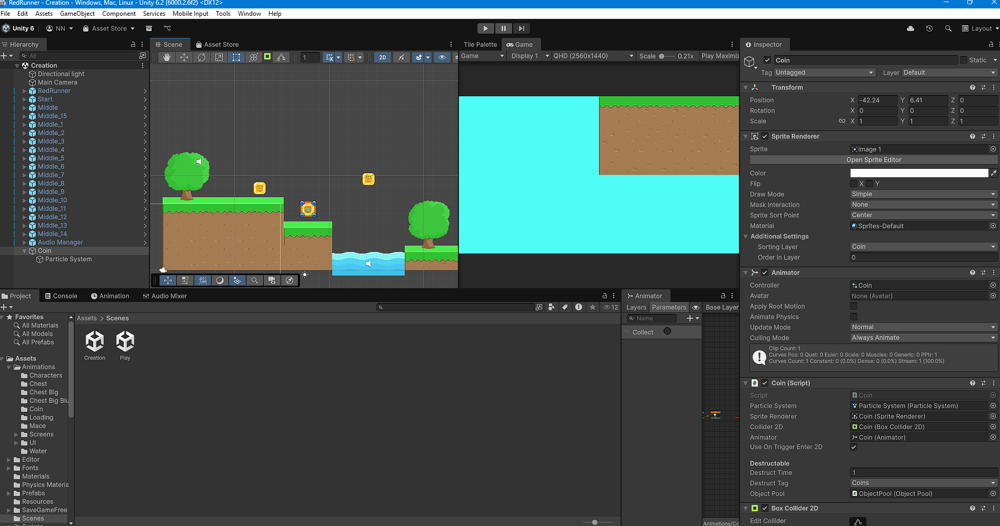

# Lab 01 - Khám phá dự án RedRunner

## ## Thông tin sinh viên
- **Họ tên**: Nguyễn Thị Trường Nga
- **MSSV**: 2312697
- **Lớp**: CTK47A

## ## Mô tả
Bài thực hành Lab 01 môn **Game 2D Development with Unity**.
Khám phá và phân tích dự án game RedRunner – một Platformer 2D mã nguồn mở được phát triển bởi Bayat Games.

## ## Các thay đổi đã thực hiện
1. Thay đổi tốc độ chạy: 8 -> 15
2. Thay đổi lực nhảy: 12 -> 24
3. Thay đổi trọng lực: 1.5 -> 0.5
4. Thêm Coin vào scene tại vị trí: x = -42,24; y =6.41

## ## Screenshots
### 1. Thay đổi thông số (Tốc độ, Lực nhảy, Trọng lực)
**Giá trị gốc:**

**Giá trị mới:**

### 2. Thêm vật phẩm (Coin)

## ## Kiến thức đã học được
1. Biết cách clone và mở một dự án Unity từ GitHub.
2. Hiểu cấu trúc thư mục của một dự án Game 2D.
3. Cách chỉnh sửa các thông số vật lý trong Inspector của Unity.
4. Cách quản lý phiên bản và commit thay đổi bằng Git.
5. Sử dụng Markdown để viết báo cáo chuyên nghiệp.

---
